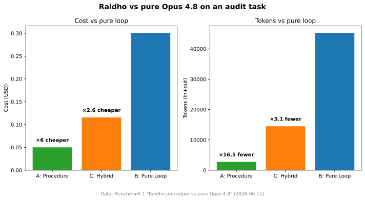
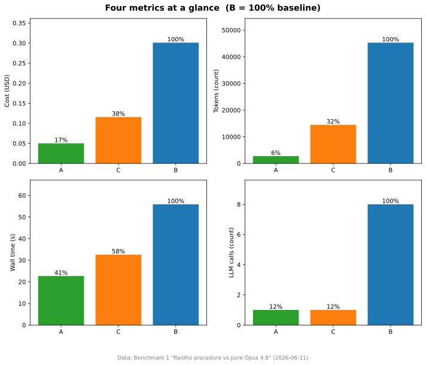
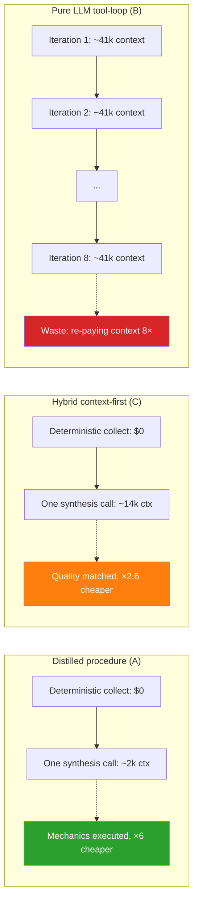
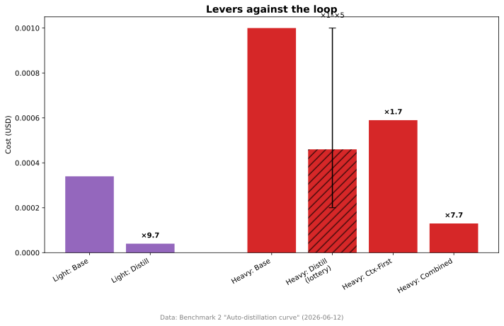
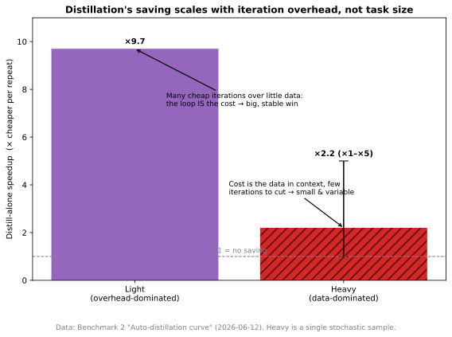
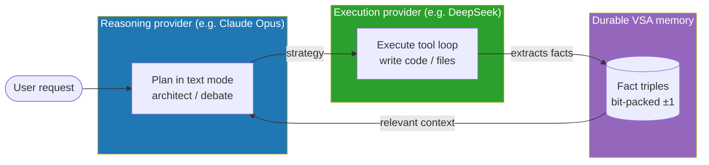
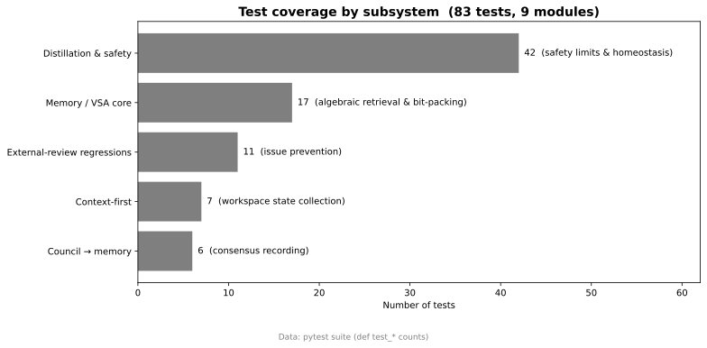
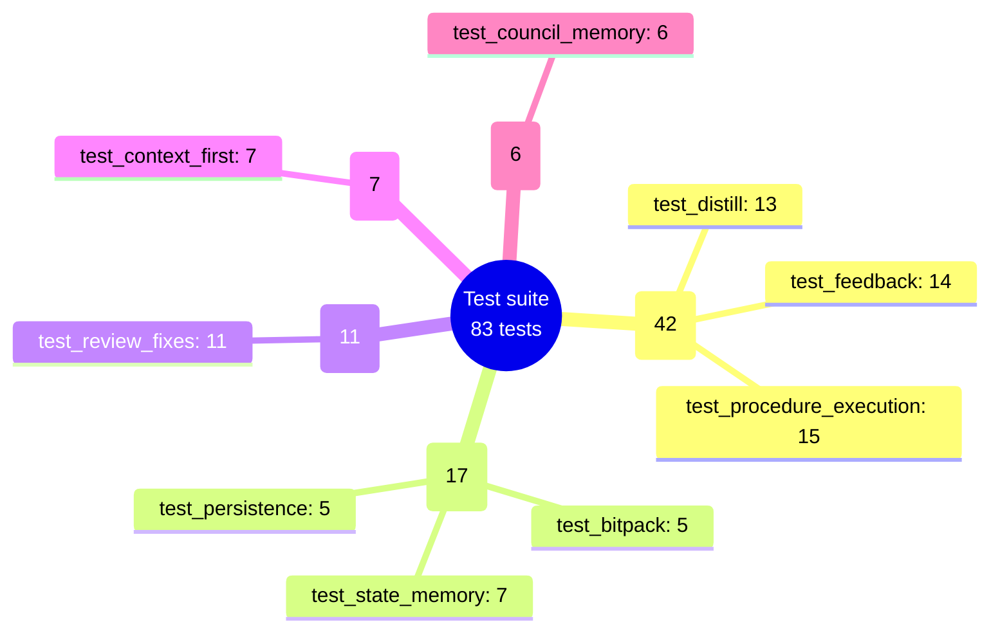

# Benchmarks & tests at a glance ᚱ

All numbers trace back to the reproducible evidence in
[`evidence/`](../evidence/) and the pytest suite. Charts are regenerated by
[`scripts/generate_visuals.py`](../scripts/generate_visuals.py) — nothing here is
invented or extrapolated.

## Benchmark 1 — Raidho vs pure Opus 4.8 (audit task, 2026-06-11)

Same task, same model (`claude-opus-4-8`), three ways. The hybrid matched the
pure tool-loop's report quality at **×2.6 less cost** and **×3.1 fewer tokens**;
the distilled procedure path is **×6 cheaper / ×16.5 fewer tokens** on the
mechanics. Source: [`evidence/2026-06-11_opus_vs_raidho/`](../evidence/2026-06-11_opus_vs_raidho/).

### Why the pure loop is expensive

The waste is not reading the code — it's the **loop** re-paying ~41k of context
on each of 8 iterations. The procedure/hybrid hand the model the same evidence in
one call.

## Benchmark 2 — Auto-distillation curve (live deepseek-chat, 2026-06-12)

The saving scales with **iteration overhead**, not task size. Source:
[`evidence/2026-06-12_autodistill_curve/`](../evidence/2026-06-12_autodistill_curve/).
⚠️ Single 5-run sample; the heavy profile is stochastic (distill alone is a ×1–×5 lottery).

## Architecture — reasoning ≠ execution

Plan on a smart model, execute on a cheap one, remember facts across runs.

## Test suite — 83 tests, 9 modules

